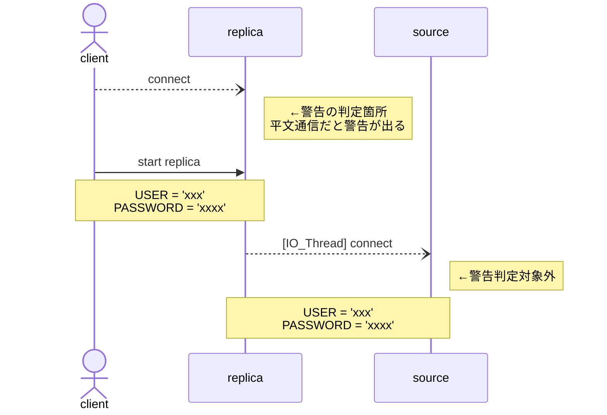

MySQL のレプリケーションを開始した時、以下のように
`Sending passwords in plain text without SSL/TLS is extremely insecure.`
の警告が出る。
**TLSv1.2接続をしているにも関わらず**だ。

これについて調査した。

```console
root@localhost[mysql-replica]> change master to master_host = 'source.host', 
-> master_port = 3306, master_ssl = 1, master_tls_version = 'TLSv1.2,TLSv1.3';
Query OK, 0 rows affected (0.01 sec)

root@localhost[mysql-replica]> start replica user = 'xxx' password = 'xxxx';
Query OK, 0 rows affected, 1 warning (0.07 sec)

root@localhost[mysql-replica]> show warnings;
+-------+------+------------------------------------------------------------------------+
| Level | Code | Message                                                                |
+-------+------+------------------------------------------------------------------------+
| Note  | 1759 | Sending passwords in plain text without SSL/TLS is extremely insecure. |
+-------+------+------------------------------------------------------------------------+
1 row in set (0.00 sec)
```

TLSv1.2接続しているかどうかは、`sys.session`および`sys.session_ssl_status`テーブルを参照した。

```console
root@localhost[mysql-source]> select conn_id,user,command,state,ssl_version,ssl_cipher
-> from sys.session s1 left join sys.session_ssl_status s2
-> on s1.thd_id = s2.thread_id where user like 'repl%';
+---------+-----------------+------------------+--------------------------------------------------------------+-------------+---------------------------+
| conn_id | user            | command          | state                                                        | ssl_version | ssl_cipher                |
+---------+-----------------+------------------+--------------------------------------------------------------+-------------+---------------------------|
|     152 | repl@172.28.0.3 | Binlog Dump GTID | Master has send all binlog to slave; waiting for more update | TLSv1.2     | DHE-RSA-AES128-GCM-SHA256 |
+---------+-----------------+------------------+--------------------------------------------------------------+-------------+---------------------------+
1 row in set (0.02 sec)
```

以後、以下の<dfn>source</dfn>,<dfn>replica</dfn>でそれぞれのサーバーをを指すこととする
<dl>
<dt>source</dt><dd>source(master)側となるDBサーバー</dd>
<dt>replica</dt><dd>replica(slave)側となるDB側サーバー</dd>
<dt>client</dt><dd>replicaへ接続するMySQLクライアント(サーバーとしては<dfn>replica</dfn>と同じ)</dd>
</dl>

## 結論
当初、 <dfn>replica</dfn> <--> <dfn>source</dfn> 間の通信の問題を疑っていた。
しかし、違った。

これは、**<dfn>client</dfn> <--> <dfn>replica</dfn> 間の通信の問題**だった。

<dfn>client</dfn> から <dfn>replica</dfn> へ接続して、`start slave USER = 'xxx' PASSWORD = 'xxxx'` のSQLを発行するわけだが、このSQL文を<dfn>replica</dfn>へ送る時の通信がSSL/TLS通信になっていないと警告が出る。
ユーザー名およびパスワードは `start slave` を発行する<dfn>client</dfn>から出るわけだから、その間の通信も暗号化されてなければ傍受される危険なのは本当にそう。

逆に、<dfn>replica</dfn> <--> <dfn>source</dfn> 間の暗号化状態は見てない。平文通信であっても警告は出ない。
（本来ならこちらでも出ないと片手落ち感があるが……）

ということで、今まで <dfn>replica</dfn>へのログインは、localhost から Socket を使っていたが、これを TLS接続に切り替えたところ、警告が出なくなった。
```console
user@replica$ mysql -u root -p -h localhost --protocol=tcp --ssl-mode=REQUIRED
```

まぁ、なんだ……、勘違い乙

いや、これ、紛らわしいでしょっ？
言われてみれば、そのまんまの警告文になっているんだけどさ。

話としてはこれで終わり。
ただ、この結論に至るためにいろいろ調査したので、それを書いておこうと思う。

## <dfn>replica</dfn> <--> <dfn>source</dfn> 間は本当に暗号化されているのか？

時系列的には、結論が出る前の話。
まずは、警告に対して守られるべきものが守られているかを確認すべき。
ということで、`tcpdump` を取って、Wireshark で見てみた。

### 平文通信時
まずは、わざと平文通信にしてどんな通信をしているか見てみる。
`change master to master_ssl = 0;` で平文通信にして、`start slave ...`をした。


1. <dfn>replica</dfn>から、`ACK`
1. <dfn>source</dfn>から、`Server Greeting` なるレスポンス
1. <dfn>replica</dfn>から、`Login Request` を送付
    - `Username`, `Password` を載せて`Login Request`をしているのが見える
1. <dfn>source</dfn>から、 `Response OK`

### TLSv1.2 接続設定時
`change master to master_ssl = 1;` でTLS通信を有効化して、`start slave ...`をした。


1. <dfn>replica</dfn>から、`ACK`
1. <dfn>source</dfn>から、`Server Greeting` なるレスポンス
1. <dfn>replica</dfn>から、`Login Request` なる通信
    - TLS通信ではなくMySQLの平文通信になっていてドキッとした
    - ただし、ここでは `Username`, `Password` は送っていない模様
1. <dfn>replica</dfn>から、TLS通信の始まりとなる`Client Hello`
1. <dfn>source</dfn>から、`Server Hello`
    - 等々、TLSのハンドシェイクが始まり、暗号化通信となる
1. 以降、認証をして、レプリケーションが始まっていると思われる

最初は平文通信！？ 認証は？ とドキッとする内容だったが、重要な部分はTLS通信となってから行っている模様。

ここで、MySQL は平文通信もTLS通信も同じポートで請け負っていることに不思議な気持ちを頂いた当時を思い出す。
通常のサーバーって、たとえばWebサーバーなら、平文を 80、TLS通信を 443 と分けてLISTENする。
MySQL はどちらも同じポート（分ける設定は見つからなかった）なことに「どうやってんの？」と。

それが、ここで判明。
`Server Greeting` や `Login Request` を経て、MySQL的なハンドシェイクをしてから、平文通信/TLS通信に移行しているようだ。
最初の非暗号化通信部分には重要な情報は載せない前提なんだろうけど、大丈夫かこれ？と疑いたくなる通信だ。

ただ、まぁそういうものだと受け入れるしかないし、TLS通信になっている確証は得られた。

しかし、TLS通信できているなら、 何故 "Sending passwords in plain text without SSL/TLS is extremely insecure." の警告が出る？ と後戻り。

## もうソースを見るしか無い

[GitHubでソース](https://github.com/mysql/mysql-server "mysql/mysql-server: MySQL Server, the world's most popular open source database, and MySQL Cluster, a real-time, open source transactional database.") を見るしかない。

この警告文で検索すれば何かしら出るだろ。とGitHubから検索したが何も出ない……。マジか

仕方ないので `git clone` して `git grep` する。

### git grep and git grep
```console
$ git grep -n "Sending passwords in plain text without SSL/TLS is extremely insecure" ^mysql-test
share/messages_to_clients.txt:6715:  eng "Sending passwords in plain text without SSL/TLS is extremely insecure."
```
テストコードと思しきものが大量に引っかかったので、除外して再検索
(対象パスの箇所の先頭に`^`を付けることで否定となり、それ以外を検索できる)。
見事にメッセージ定義ファイルと思われるものが出てきた。

```console
$ view +:6715 share/messages_to_clients.txt
(snip)
ER_INSECURE_PLAIN_TEXT
  eng "Sending passwords in plain text without SSL/TLS is extremely insecure."
(snip)
```
で確認。 変数名っぽいもの `ER_INSECURE_PLAIN_TEXT` をゲット。
これで再度検索。

```console
$ git grep -nw ER_INSECURE_PLAIN_TEXT
share/messages_to_clients.txt:6714:ER_INSECURE_PLAIN_TEXT
sql/rpl_replica.cc:8819:      push_warning(thd, Sql_condition::SL_NOTE, ER_INSECURE_PLAIN_TEXT,
sql/rpl_replica.cc:8820:                   ER_THD(thd, ER_INSECURE_PLAIN_TEXT));
sql/rpl_replica.cc:9555:      push_warning(thd, Sql_condition::SL_NOTE, ER_INSECURE_PLAIN_TEXT,
sql/rpl_replica.cc:9556:                   ER_THD(thd, ER_INSECURE_PLAIN_TEXT));
```

### rpl_replica.cc
[sql/rpl_replica.cssの8792〜8822行あたり](https://github.com/mysql/mysql-server/blob/8.0/sql/rpl_replica.cc#L8792-L8822) に `start_slave` 関数が定義されていて、その中で

```cc
bool start_slave(THD *thd, ...) {
// (snip)
  if (connection_param->user || connection_param->password) {
    if (!thd->get_ssl()) {
      push_warning(thd, Sql_condition::SL_NOTE, ER_INSECURE_PLAIN_TEXT,
                   ER_THD(thd, ER_INSECURE_PLAIN_TEXT));
    }
  }
// (snip)
}
```

うん、ここだね。
- パラメータに、`user` か `password` があり
- `thd->get_ssl()` が偽

なら警告が出る。

- `user`, `password` は `start slave`実行時に与えているのでこの条件に見事に一致。
- 問題は `thd->get_ssl()` だ。
    -  `thd` はスレッドっぽい。そのSSL状態を取るのだろうが、TLS接続できているのに何故 偽となる？
    - って、`thd` って引数で与えられているのか。
    - レプリケーションの IO Thread のことだと思っていたが、`start_slave` 実行前からスレッドの値があるのはおかしくないか？
      （この辺りで自分の勘違いに気付き始める）
    - もしかして、このスレッドって <dfn>replica</dfn> に接続している <dfn>client</dfn> のスレッド…？


そういえば、 `ER_INSECURE_PLAIN_TEXT` を使用している箇所がもう一つあるな。そちらも見てるか。

[sql/rpl_replica.cssの9503〜9560行あたり](https://github.com/mysql/mysql-server/blob/8.0/sql/rpl_replica.cc#L9503-L9560)。
```cc
static int change_receive_options(THD *thd, ...) {
// (snip)
  if (lex_mi->user || lex_mi->password) {
    if (!thd->get_ssl()) {
      push_warning(thd, Sql_condition::SL_NOTE, ER_INSECURE_PLAIN_TEXT,
                   ER_THD(thd, ER_INSECURE_PLAIN_TEXT));
    }
    push_warning(thd, Sql_condition::SL_NOTE, ER_INSECURE_CHANGE_MASTER,
                 ER_THD(thd, ER_INSECURE_CHANGE_MASTER));
  }
// (snip)
}
```
こちらは、`change master to`にあたる部分だな。
ここでもスレッド…。
`change master to` でレプリケーションの IO Thread が出てくることはないだろう。
<dfn>client</dfn> のスレッドで確定だろう。

<dfn>client</dfn>のSSL状態か……、そういえば、localhostからSocketで繋げてるな……?

なるほど！！！（結論へ）
